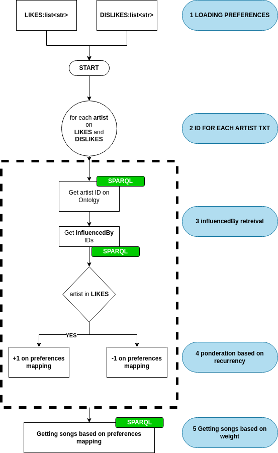

# MSC_AI_KW_Project

Welcome to the MSC_AI_KW_Project! This project is a music recommendation system that leverages semantic data, SPARQL queries, and knowledge graphs (KW) to deliver personalized music suggestions. By integrating data from sources such as YAGO and Wikidata, our system combines both content-based and collaborative filtering techniques to analyze user preferences and provide accurate recommendations.

## Table of Contents

- [Overview](#overview)
- [Project Summary](#project-summary)
- [Technical Report](#technical-report)
- [Installation](#installation)
- [Running the Web Server](#running-the-web-server)
- [Testing the Recommenders](#testing-the-recommenders)
- [System Architecture](#system-architecture)
- [Usage](#usage)
- [Contributing](#contributing)
- [License](#license)

## Overview

Music is an integral part of our lives, providing us with emotional accompaniment through various moods and moments. However, with the overwhelming number of available tracks and albums, finding the right music that resonates with each individual can be challenging. Our Music Recommendation System addresses this problem by merging semantic data and advanced recommendation algorithms to deliver a fresh approach to personalized music suggestions.

## Project Summary

Our system is designed to:
- **Analyze user preferences:** Users can input their favorite artists, and the system gathers this information via a user-friendly interface.
- **Generate recommendations:** The recommendation engine uses two main modules:
  - **Content-Based Filtering:** Evaluates features such as genre, tempo, mood, and instruments.
  - **Collaborative Filtering:** Identifies patterns by comparing user preferences with similar users.
- **Integrate semantic data:** Using external knowledge sources (YAGO and Wikidata) alongside SPARQL queries, the system deepens its understanding of music entities and relationships.
- **Fetch real-time data:** APIs (e.g., Spotify API) are used to retrieve up-to-date track information, artist details, and playlists.
- **Incorporate user feedback:** Continuous improvement is enabled by refining recommendations based on user feedback.

## Technical Report

For an in-depth explanation of the architecture, methodologies, and experiments behind the system, please refer to the technical report:
[msc_ai_kw_project.pdf](msc_ai_kw_project.pdf)

## Installation

Before running the project, install all required libraries:

```bash
pip install -r requirements.txt
```

## Running the Web Server

To start the web server:

```bash
cd Project
python run.py
```

## Testing the Recommenders
You can test the individual recommendation systems using Jupyter Lab. Open the provided notebooks to see the recommendation engines in action:

- test_for_wikidata.ipynb
- test_for_yago.ipynb
Launch Jupyter Lab with:
```bash
jupyter-lab
```

## System Architecture
The system is divided into the following key components:

1. User Interface (Front-End)
Technologies: JavaScript, Flask.
Features:
Input of favorite artists.
Display of personalized recommendations.
Collection of user feedback.
2. Recommendation Engine (Back-End)
Modules:
Content-Based Filtering: Analyzes track features such as genre and mood.
Collaborative Filtering: Leverages patterns in user behavior to refine suggestions.
Learning Mechanism: Continuously improves through user feedback.
3. Semantic Data Integration
Sources: YAGO and Wikidata.
Method: Uses SPARQL queries to access structured information, enriching the recommendation process with deeper insights into musical entities.
4. Music Information Retrieval
APIs: Spotify API and others to fetch real-time music data.
5. Data Flow
Below is the process flow of how the system operates:


<p align="center">
  
</p>

1. **User Input:** Preferences are entered via the front-end.
2. **Data Processing:** The back-end integrates semantic data for enhanced context.
3. **Recommendation Generation:** Applies both filtering techniques.
4. **Music Retrieval:** Fetches track details from external APIs.
5. **Feedback Loop:** Refines future recommendations based on user responses.

## Usage

After setting up and running the server, users can interact with the system by:

- Entering their music preferences.
- Viewing the recommendations.
- Providing feedback on suggestions to further enhance the recommendation accuracy.

## Contributing

Contributions to the project are welcome! Please follow these steps:

1. Fork the repository.
2. Create a feature branch: `git checkout -b feature/YourFeature`
3. Commit your changes: `git commit -am 'Add some feature'`
4. Push the branch: `git push origin feature/YourFeature`
5. Open a pull request.
